# Database Schema

## Platform note

This document was originally written against Shopware 6.7 / MySQL. The shop platform was switched to **Medusa.js v2** (Node/TypeScript, PostgreSQL) during Phase 6 planning — see `decisions.md`'s "Shop system" section for why. This is a full re-expression of the same entity-relationship thinking in Medusa's module/module-link model, not a from-scratch redesign — every entity, constraint, and business rule already decided (2-store Click & Collect, TriCon field mappings, GDPR retention, payment-instrument security) carries over; only the physical implementation vocabulary changes (Shopware entities/DAL → Medusa modules/module-links, MySQL → PostgreSQL).

**Framework-API caveat:** exact Medusa v2 module/field names below reflect the framework's documented conventions, not a live install. Items marked **[verify]** should be confirmed against the pinned Medusa version at implementation time — same posture this document took toward Shopware specifics throughout its earlier drafts.

## Purpose & scope

This is the full entity-relationship design for the shop's data — every entity the storefront, cart/checkout, customer account area, and Tridata/TriCon sync need, at field level. It targets **PostgreSQL** (Medusa's required database), via Medusa's own module system rather than a separate application database.

Medusa ships a substantial commerce data model out of the box, organized as independent **modules** (Product, Order, Customer, Inventory, Stock Location, Fulfillment, Payment, Promotion, Pricing, Tax, Region, …). To avoid quietly re-implementing what already exists — or missing what it doesn't cover — every entity below is tagged with its **Medusa status**:

- **native** — an existing Medusa module's entity, used as-is, no changes needed.
- **extended** — an existing Medusa entity, plus a custom module's data linked to it via Medusa's **module link** system (`defineLink`) — the direct equivalent of the earlier Shopware "one-to-one extension table" pattern, and a cleaner one: a module link is a real, typed relationship generated by Medusa's own migration tooling, not an app-validated polymorphic reference.
- **custom** — a wholly new module with no Medusa equivalent.

A structural simplification worth calling out up front: **Medusa doesn't version core entities** the way Shopware's DAL did (no `(id, version_id)` composite keys on `Product`/`Order`/`Category`). Every custom module below links to a plain single `id`, not a composite key — this removes a whole category of FK complexity the Shopware-era draft had to carry throughout.

Phase 5 (this document) is design only. Phase 6 (Backend build, Claude Code) implements it as Medusa modules, module links, workflows, and the TriCon sync integration — see the Phase 6 planning record for that architecture.

### Naming & versioning conventions

- **Module naming.** Custom modules use a short kebab-case name (e.g. `store-profile`, `tridata-sync`, `saved-payment-instrument`) per Medusa's own convention, living under `src/modules/<name>/`. No table-prefix convention is needed the way Shopware's `bikeone_` prefix was, since Medusa modules already namespace their own tables.
- **ID columns.** Postgres has a native `uuid` type; Medusa's own IDs are prefixed strings (e.g. `prod_01H...`, `order_01H...`) rather than bare UUIDs **[verify exact ID format on the pinned version]** — the ERD below shows `id` as a domain label for readability regardless of the exact physical format.
- **No versioned-entity FKs.** Unlike the Shopware-era draft, no custom module needs a composite `(id, version_id)` foreign key — Medusa's core entities aren't versioned this way. A module link to `Product`/`Order` is a plain single-column reference.
- **Enums.** Fields marked `enum` in the diagram are a domain label. Postgres has a native `ENUM` type but it shares some of MySQL's rigidity (adding a value still needs `ALTER TYPE ... ADD VALUE`, with its own restrictions), so the same recommendation holds: implement as `VARCHAR` + `CHECK` constraint for schema-migration-free flexibility.
- **Reserved words.** `order` is not a reserved word in PostgreSQL the way it is in some SQL dialects, but Medusa's own table for it is namespaced (`order` module) regardless — no special quoting concern carries over from the Shopware-era note.

## Entity overview

| Entity | Medusa status | Notes |
| --- | --- | --- |
| `region` | native | Bundles currency + countries + tax defaults — one region (EUR, DE/AT/CH) covers what Shopware modeled as separate `currency`/`country` entities |
| `sales_channel` | native | Storefront + (possibly) per-store channels — same concept as Shopware's, one channel is enough for v1 |
| `payment_provider` | native (module registration, not a data table) | SumUp registered as a custom Payment Provider (see Phase 6 plan); PayPal routes through the same provider, no separate integration |
| `shipping_option` | native | Standard, Express — tied to a `fulfillment_set` per `stock_location` |
| `promotion` | native | Medusa's Promotion Module (rules + application methods + campaigns) covers coupon codes (e.g. `BIKEONE10`) — more structured natively than Shopware required for the same v1 scope |
| `product_category` | native | 6 top-level cats + parent grouping, native tree via `parent_category_id` |
| `product_tag` | native | Simple multi-value labels — used for the usage-tag facet (allroad/bikepacking/renneinsatz/schotter), since it's a filter facet, not a variant-generating option |
| `product_option` / `product_option_value` | native | Variant-generating facets only — frame size (Rahmengröße) |
| `product` / `product_variant` | native, structurally simpler than the Shopware-era draft | Medusa has a **real** `ProductVariant` table (one row per size/color combination, `product_id` FK to its parent), not a self-referential `parent_id` hack — a genuine data-model improvement over the Shopware draft |
| `product-brand` | **custom** (not native — flagged below) | Medusa core has no built-in manufacturer/brand entity; needs a small custom module or `product_type` reuse — see open questions |
| `customer` | native | |
| `customer_address` | native | Address book, native `addresses` relation on `Customer` |
| `order` | native, extended via module link | Delivery type, pickup slot — via a linked custom module, not columns added to core `Order` |
| `stock_location` | native | 2 fixed physical locations — replaces the Shopware-era custom `bikeone_store` entity outright for the address/name/phone fields |
| `inventory_item` / `inventory_level` | native | Per-location stock quantities (`stocked_quantity`/`reserved_quantity`) — replaces most of the Shopware-era custom `bikeone_store_stock` table |
| `store-profile` | custom (linked to `stock_location`) | `opening_hours` (structured), `email` — the part of the old `bikeone_store` design `stock_location` doesn't cover natively |
| `tridata-stock-snapshot` | custom (linked to `inventory_item`) | Raw TriCon stock fields (`Lagerbestand`/`Reserviert`/`Bestellt`/`MengeVerfuegbar`) per (variant × location) — the reduced descendant of `bikeone_store_stock` |
| `saved-payment-instrument` | custom (linked to `customer`) | Tokenized saved cards — direct descendant of `bikeone_payment_instrument` |
| `order-fulfillment-extension` | custom (linked to `order`) | `delivery_type`, `pickup_store_id` (→ `stock_location`), `pickup_slot_start`, `pickup_note` — direct descendant of `bikeone_order_extension` |
| `tridata-sync` module (`TridataProductMap`, `TridataOrderMap`, `TridataSyncLog`) | custom | ID mapping (two typed models, linked to `product`/`order` respectively) + append-only sync log — replaces the single polymorphic `bikeone_tridata_entity_map` table with real typed links |

## Entity-relationship diagram

```mermaid
erDiagram
    CUSTOMER ||--o{ CUSTOMER_ADDRESS : has
    CUSTOMER ||--o{ SAVED_PAYMENT_INSTRUMENT : has
    CUSTOMER ||--o{ ORDER : places

    ORDER ||--o| ORDER_FULFILLMENT_EXTENSION : "extended by (link)"
    ORDER ||--o{ ORDER_LINE_ITEM : contains
    ORDER ||--o{ PAYMENT : "paid via"
    ORDER ||--o{ FULFILLMENT : "shipped/picked up via"
    FULFILLMENT }o--|| SHIPPING_OPTION : uses
    ORDER_FULFILLMENT_EXTENSION }o--o| STOCK_LOCATION : "picked up at"
    ORDER ||--o| TRIDATA_ORDER_MAP : "synced via (link)"

    PROMOTION ||--o{ ORDER_LINE_ITEM : "applied as adjustment"
    PRODUCT_VARIANT ||--o{ ORDER_LINE_ITEM : "ordered as"

    PRODUCT ||--o{ PRODUCT_VARIANT : "has variants"
    PRODUCT }o--o{ PRODUCT_CATEGORY : "listed in"
    PRODUCT }o--o{ PRODUCT_TAG : "has facets"
    PRODUCT }o--|| PRODUCT_BRAND : "brand"
    PRODUCT ||--o| TRIDATA_PRODUCT_MAP : "synced via (link)"
    PRODUCT_VARIANT ||--o{ PRODUCT_OPTION_VALUE : "combination of"
    PRODUCT_VARIANT ||--o{ INVENTORY_ITEM : "tracked as"

    PRODUCT_CATEGORY ||--o{ PRODUCT_CATEGORY : "parent of"
    PRODUCT_OPTION ||--o{ PRODUCT_OPTION_VALUE : "has values"

    STOCK_LOCATION ||--o{ INVENTORY_LEVEL : "has stock rows"
    INVENTORY_ITEM ||--o{ INVENTORY_LEVEL : "per location"
    INVENTORY_ITEM ||--o{ TRIDATA_STOCK_SNAPSHOT : "per location"
    STOCK_LOCATION ||--o| STORE_PROFILE : "extended by (link)"

    TRIDATA_PRODUCT_MAP ||--o{ TRIDATA_SYNC_LOG : "has attempts"
    TRIDATA_ORDER_MAP ||--o{ TRIDATA_SYNC_LOG : "has attempts"

    CUSTOMER {
        id id PK
        string first_name
        string last_name
        string email
    }
    CUSTOMER_ADDRESS {
        id id PK
        id customer_id FK
        string country_code
        string first_name
        string last_name
        string address_1
        string postal_code
        string city
        string phone
    }
    SAVED_PAYMENT_INSTRUMENT {
        id id PK
        id customer_id FK
        string provider
        string brand
        char last4
        tinyint expiry_month
        smallint expiry_year
        string provider_token_reference
        bool is_default
    }
    ORDER {
        id id PK
        id customer_id FK
        id region_id FK
        int display_id
        datetime created_at
        decimal total
    }
    ORDER_FULFILLMENT_EXTENSION {
        id id PK
        id order_id FK
        enum delivery_type
        id pickup_store_id FK
        datetime pickup_slot_start
        string pickup_note
    }
    PAYMENT {
        id id PK
        id order_id FK
        string provider_id
        decimal amount
        enum status
    }
    FULFILLMENT {
        id id PK
        id order_id FK
        id shipping_option_id FK
        datetime shipped_at
    }
    ORDER_LINE_ITEM {
        id id PK
        id order_id FK
        id product_variant_id FK
        string title
        int quantity
        decimal unit_price
    }
    PRODUCT {
        id id PK
        id brand_id FK
        string title
        string handle
        text description
        json spec_attributes
        bool online_visible
        int popularity_score
    }
    PRODUCT_VARIANT {
        id id PK
        id product_id FK
        string title
        string sku
        decimal price
    }
    PRODUCT_BRAND {
        id id PK
        string name
    }
    PRODUCT_CATEGORY {
        id id PK
        id parent_category_id FK
        string name
        string handle
    }
    PRODUCT_TAG {
        id id PK
        string value
    }
    PRODUCT_OPTION {
        id id PK
        string title
    }
    PRODUCT_OPTION_VALUE {
        id id PK
        id option_id FK
        string value
    }
    STOCK_LOCATION {
        id id PK
        string name
        string address_1
        string postal_code
        string city
        string phone
    }
    STORE_PROFILE {
        id id PK
        id stock_location_id FK
        json opening_hours
        string email
    }
    INVENTORY_ITEM {
        id id PK
        id product_variant_id FK
        string sku
    }
    INVENTORY_LEVEL {
        id id PK
        id inventory_item_id FK
        id stock_location_id FK
        int stocked_quantity
        int reserved_quantity
    }
    TRIDATA_STOCK_SNAPSHOT {
        id id PK
        id inventory_item_id FK
        id stock_location_id FK
        decimal lagerbestand
        decimal reserviert
        decimal bestellt
        decimal menge_verfuegbar
        datetime last_synced_at
    }
    SHIPPING_OPTION {
        id id PK
        string name
        decimal price
    }
    PROMOTION {
        id id PK
        string code
        decimal discount_percent
    }
    TRIDATA_PRODUCT_MAP {
        id id PK
        id product_id FK
        string tridata_external_id
        char payload_hash
        datetime last_synced_at
    }
    TRIDATA_ORDER_MAP {
        id id PK
        id order_id FK
        string tridata_external_id
        char payload_hash
        datetime last_synced_at
    }
    TRIDATA_SYNC_LOG {
        id id PK
        id map_id FK
        enum map_type
        enum direction
        enum status
        tinyint attempt_count
        string last_error
        datetime attempted_at
        datetime synced_at
    }
```

Native and custom entities are mixed here on purpose, same as the earlier draft, so the diagram reads as a complete model. `TRIDATA_PRODUCT_MAP`/`TRIDATA_ORDER_MAP` — unlike the earlier draft's single polymorphic `bikeone_tridata_entity_map` table — are two separate typed models, each with a real single-column FK to its own entity (`product_id`/`order_id`), which is what Medusa's module-link system naturally produces. `TRIDATA_SYNC_LOG.map_id` + `map_type` still needs a small amount of app-level dispatch (which map table `map_id` refers to), since the log is one shared table for both — a much narrower version of the old polymorphic-reference problem, confined to one small append-only table instead of the primary lookup structure. `spec_attributes` stays a `json` field per the customFields-equivalent decision below.

## Native Medusa entities (used as-is)

These need no custom module; they're listed so the ERD is complete and Phase 6 doesn't reinvent them.

- **`region`** — bundles currency (EUR), countries (DE/AT/CH), and tax defaults in one entity. One region is enough for v1; replaces the Shopware-era draft's separate `currency`/`country` native entities.
- **`sales_channel`** — the storefront. One channel is enough for v1; the 2 physical stores are modeled as `stock_location`, not separate sales channels, since they share one catalog/checkout and only differ by pickup location — unchanged reasoning from the Shopware-era draft.
- **`payment_provider`** — not a data table but a module registration point. SumUp is registered as a custom Payment Provider (Phase 6); card and PayPal both route through it, matching the existing SumUp-only decision.
- **`shipping_option`** — Standard (€6.90) and Express (€12.90), tied to a `stock_location`'s `fulfillment_set`; a pickup-type option per store generalizes the same mechanism to Click & Collect (see Phase 6 plan).
- **`promotion`** — Medusa's Promotion Module (rules + application methods, optionally grouped into campaigns) covers the coupon-code + percentage-discount behavior in the cart wireframe (hardcoded `BIKEONE10` = 10%) with more native structure than the Shopware-era draft needed to describe — no custom module needed.
- **`product_category`** — native tree via `parent_category_id`, covers both the 6 top-level categories (Rennrad, Gravel, Zubehör, Komponenten, Bekleidung, Werkstatt/Service) and the "Fahrräder" grouping implied by the gravel-bikes breadcrumb.
- **`product_tag`** — simple multi-value labels, used for the usage/riding-style tag (Einsatzbereich: allroad/bikepacking/renneinsatz/schotter) — this is a filter facet, not something that generates variants, so it belongs on `product_tag`, not `product_option`.
- **`product_option`** / **`product_option_value`** — variant-generating facets specifically: frame size (Rahmengröße). Unlike Shopware's `property_group`, which served both variant-generating and non-variant facets through one mechanism, Medusa splits these — options generate variants, tags don't. Color, if it becomes a real requirement later, is the same kind of option as size.
- **`product`** / **`product_variant`** — Medusa's real variant model: one `Product` row, one `ProductVariant` row per size (each `product_variant_id` FK'd to its parent `product_id`), each variant with its own `sku` and price. This is a genuine improvement over the Shopware-era draft's `parent_id` self-referential-row hack — no "is this product row actually a variant" ambiguity, and `inventory_item`/`inventory_level` key directly off the real variant row.
- **`customer`** — profile fields (`first_name`, `last_name`, `email`) match Medusa's native Customer fields directly.
- **`customer_address`** — native `addresses` relation on `Customer`, matching the account-area wireframe's multiple-addresses requirement. **[Verify default-address mechanism against the pinned version — Medusa's exact default-billing/default-shipping pointer convention should be confirmed, mirroring the same caution the Shopware-era draft applied to this exact question.]**
- **`stock_location`** — 2 fixed rows (Oldenburg, Osnabrück), name/address/phone all native fields. Directly replaces most of the Shopware-era custom `bikeone_store` entity — see "New custom modules" below for the small remainder (`opening_hours`, `email`) that still needs a linked custom module.
- **`inventory_item`** / **`inventory_level`** — per-(variant × location) `stocked_quantity`/`reserved_quantity`, the mechanism Medusa's own cart/order/reservation logic reads and enforces against. Directly replaces most of the Shopware-era custom `bikeone_store_stock` table — see "New custom modules" for the remainder (the raw TriCon fields) still needed alongside it.

## Extended Medusa entities

### `order` — pickup/delivery extension

Medusa's native `Order` covers customer, line items, payments (via the Payment module), and fulfillments (via the Fulfillment module) — no changes needed there. What the Shopware-era draft added as `delivery_type`/`pickup_store_id`/`pickup_slot`/`return_state` now lives in a linked custom module instead of raw columns on core `Order` (same principle as before — never edit a core module's own table directly):

#### `order-fulfillment-extension` (custom module, linked 1:1 to `order`)

| Field | Type | Purpose | Tridata ownership |
| --- | --- | --- | --- |
| `order_id` | FK → `order.id` (module link) | Ties the extension row to its order | — |
| `delivery_type` | varchar + CHECK (`shipping`, `pickup`) | Cart/checkout delivery method choice | Shop-owned |
| `pickup_store_id` | FK → `stock_location.id`, nullable | Which store, when `delivery_type = pickup` | Shop-owned |
| `pickup_slot_start` | datetime, nullable | Structured slot start time | Shop-owned |
| `pickup_note` | varchar, nullable | Free-text fallback, e.g. "we'll contact you" | Shop-owned |

Same `CHECK`-constraint consistency rule as before: `pickup_store_id` set if and only if `delivery_type = 'pickup'`; `pickup_slot_start`/`pickup_note` null when `delivery_type = 'shipping'`.

**Decided: keep this custom module** rather than modeling pickup purely as a Click & Collect `shipping_option` — a `shipping_option` still can't natively carry a specific store choice or pickup time slot, so folding pickup into it wouldn't remove the need for this module, just make the delivery-type distinction implicit. The explicit field is easier to query. **Confirmed by the real TriCon interface:** `pickup_store_id` maps directly onto TriCon's `Filialname` field on `UploadOrder` — see [tricon-integration-notes.md](../3-Architecture_Tech_Stack/tricon-integration-notes.md), still gated on the same open "one interface for all branches" vendor question as before.

**`return_state` still removed**, same reasoning as the Shopware-era draft: it's purely a function of elapsed time since delivery and would go stale unless proactively recomputed — compute it at read time from the fulfillment's shipped/delivered date plus the 30-day window, not stored.

**No native order-number pattern generator.** Medusa's `Order.display_id` is a plain auto-incrementing integer — there's no equivalent to Shopware's configurable `number_range` pattern that produced `BO-YYYY-NNNNNN`. If a formatted customer-facing order number is still wanted, it needs a small custom workflow step at order-creation time to generate and store one (as its own field, distinct from `display_id`, which this schema reserves for TriCon's `WebShopOrderID` instead — see the sync module below). Flagged as a genuinely new open item from the platform switch, not resolved here.

**Data retention.** `customer` must never cascade-delete into `order` (or `order-fulfillment-extension`). German tax law requires order records be retained roughly 10 years (§147 AO, §257 HGB) regardless of customer deletion requests. **[Verify Medusa's customer-deletion/anonymization flow against the pinned version]** — Shopware's native `order_customer` snapshot pattern (copying customer data onto the order at purchase time so orders survive customer deletion) is the kind of mechanism to look for; if Medusa doesn't snapshot this natively, it needs building.

### `product` — spec/visibility extension

| Field | Type | Purpose | Tridata ownership |
| --- | --- | --- | --- |
| `spec_attributes` | JSON (`metadata` field) | Free-text spec table pairs: Rahmen, Gabel, Schaltung, Bremsen, Laufräder, Reifen, Sattelstütze, Gewicht, Max. Zuladung, Rahmengrößen, Farbe. Display-only, not filterable — a facet needing filtering belongs on `product_tag`/`product_option`, not here | Shop-owned (editorial content, not Tridata) |
| `online_visible` | boolean (plain field or `metadata`) | Whether this Tridata-stocked item is listed in the shop at all. Business rule: `true` only for items with physical on-site stock at one of the 2 stores — a Tridata SKU with no in-store stock stays `false` ([questions.de.md:85-87](../2-Product_Requirements/questions.de.md)) | Shop-owned, derived from in-store stock presence |
| `popularity_score` | int (plain field or `metadata`) | Sort key for "popular" listing sort. Recomputed in a nightly batch job from sales data, written only when it changes | Shop-owned (derived from sales data) |

**Decided:** `spec_attributes` uses Medusa's generic `metadata` JSONB field (the direct equivalent of Shopware's `customFields` blob) rather than a structured model — same reasoning as before: these fields are editorial/display-only, so the flexibility of adding a spec key without a migration wins. `online_visible`/`popularity_score` are hot filter/sort fields queried on every listing page — recommend real typed columns (via a small linked module, mirroring the pattern used for order/store extensions) rather than `metadata`, since JSONB fields aren't efficiently indexable/sortable the way a real column is. **[Confirm whether Medusa's Product module supports adding real custom columns directly, or whether this also needs a module-link pattern like the order/store extensions — verify at implementation time.]**

**Removed, same as the Shopware-era draft:** a separate `usage_tag` column — `product_tag` (native) is the single source of truth. **Removed, same as before:** a denormalized `tridata_article_number` cache column — any code needing the Tridata article number joins `TridataProductMap` instead.

Size variants (Rahmengröße) use Medusa's native `product_option`/`product_variant` system — a real `ProductVariant` row per size, not a self-referential hack. This covers the per-size stock states (`lager`/`bestellbar`/`oos`) via `InventoryLevel`, same as before.

**Stock authority.** `InventoryLevel.stocked_quantity`/`reserved_quantity` (native) and `tridata-stock-snapshot` (custom) both represent stock, fed from the same Tridata inbound sync — neither is independently shop-owned. The sync job writes the raw snapshot (fidelity/idempotency) and derives an `InventoryLevel` value chosen so Medusa's own computed availability reproduces `menge_verfuegbar` exactly, per the sync-model note below — never trust Medusa's own arithmetic on raw `Lagerbestand`/`Reserviert` to happen to agree with TriBike's own adjustment logic.

Google Merchant Center feed fields (product ID, title, description, price, availability, GTIN/MPN, image, category — [questions.de.md:131](../2-Product_Requirements/questions.de.md)) map to native Medusa product/variant/inventory fields plus the extensions above; generated as a backend-side scheduled job (needs a full catalog+inventory+pricing join), not a separate feed table.

**Genuinely new open item: no native brand/manufacturer entity.** Medusa core doesn't ship a `product_manufacturer`-equivalent the way Shopware did — brand needs either a small custom `product-brand` module (linked to `product`) or reuse of Medusa's native `product_type` field for the same purpose. Recommend the small custom module, since `product_type` may be needed for its own purpose later (e.g. "bike" vs. "accessory" vs. "apparel" as a type, distinct from brand) — flagged for a Phase 6 decision, not resolved here.

## New custom modules

### `store-profile` (linked 1:1 to `stock_location`)

The part of the Shopware-era `bikeone_store` design that `stock_location` doesn't cover natively.

| Field | Type | Notes |
| --- | --- | --- |
| `stock_location_id` | FK → `stock_location.id` (module link) | |
| `opening_hours` | JSON | Structured per-weekday open/close times, not a display string — lets Phase 6 compute "open now" without parsing text |
| `email` | varchar | `stock_location` has no native contact-email field |

### `tridata-stock-snapshot` (linked to `inventory_item`, per `stock_location`)

Per-store, per-variant raw stock cache for Click & Collect, since Tridata is the single source of truth and this module is a synced read cache, not shop-owned state.

| Field | Type | Notes |
| --- | --- | --- |
| `inventory_item_id` | FK → `inventory_item.id` | |
| `stock_location_id` | FK → `stock_location.id` | |
| `lagerbestand` | decimal | Physical stock on hand at this store, per TriCon's field of the same name |
| `reserviert` | decimal | Already reserved against other (e.g. in-store) orders |
| `bestellt` | decimal | On order from a supplier / backordered |
| `menge_verfuegbar` | decimal | TriBike's own authoritative sellable quantity — checkout and the storefront's `in_stock`/`bestellbar`/`oos` display states derive from this field directly, not a shop-side recomputation |
| `last_synced_at` | datetime | Freshness of the Tridata-sourced cache |

`UNIQUE (inventory_item_id, stock_location_id)` makes the sync job's per-poll upsert idempotent. All four TriCon fields are `decimal`, not `int` — TriCon returns them as `double`, and some accessories may be sold by weight/length.

**Open, vendor-side (not a design gap):** whether TriCon's branch-aware stock functions apply to BikeOne's 2-store setup at all depends on how the connected TriBike instance is configured — see [tricon-integration-notes.md](../3-Architecture_Tech_Stack/tricon-integration-notes.md). This module's design holds either way; the sync job's exact shape depends on the answer.

### `saved-payment-instrument` (linked to `customer`)

Tokenized saved cards only — never raw card data, matching the "processor-hosted secure widget" checkout flow and the masked brand+last4+expiry shown in the account area.

| Field | Type | Notes |
| --- | --- | --- |
| `customer_id` | FK → `customer.id` (module link, cascade on delete) | Unlike orders, saved cards carry no statutory retention duty |
| `provider` | varchar | e.g. `sumup` |
| `brand` | varchar | e.g. "Visa" |
| `last4` | char(4), CHECK (4 digits) | |
| `expiry_month` | tinyint, CHECK (1–12) | |
| `expiry_year` | smallint | |
| `provider_token_reference` | varchar, UNIQUE per `provider` | Opaque SumUp token reference; no raw PAN ever stored |
| `is_default` | boolean | |

**Security note**, unchanged from the Shopware-era draft: `provider_token_reference` is a charge-capable secret. Restricted DB access, never logged, never returned beyond masked display fields. Expired instruments purged by a scheduled job. PayPal has no row here (fresh choice each checkout, not a saved wallet method).

### `tridata-sync` module — `TridataProductMap`, `TridataOrderMap`, `TridataSyncLog`

The Shopware-era draft's single polymorphic `bikeone_tridata_entity_map` table becomes **two typed models**, each a real single-column FK via a module link, rather than an app-validated `(entity_type, entity_id)` pair:

#### `TridataProductMap` (linked to `product`)

| Field | Type | Notes |
| --- | --- | --- |
| `product_id` | FK → `product.id` (module link) | |
| `tridata_external_id` | varchar | TriBike's `ArtikelID` (GUID) — **TriBike mints this ID**, the shop only stores it |
| `payload_hash` | char(64) | Skip writing (and re-indexing) unchanged rows |
| `last_synced_at` | datetime | |

#### `TridataOrderMap` (linked to `order`)

| Field | Type | Notes |
| --- | --- | --- |
| `order_id` | FK → `order.id` (module link) | |
| `tridata_external_id` | varchar | TriCon's `WebShopOrderID` (int) — **the shop mints this ID**, the reverse direction from products. Recommendation: reuse Medusa's native `Order.display_id` **[verify exact semantics/uniqueness guarantee before committing]** — distinct from both TriBike's own internal order numbers and any formatted customer-facing order number the shop generates (see the "no native order-number pattern generator" note above) |
| `payload_hash` | char(64) | |
| `last_synced_at` | datetime | |

`UNIQUE (tridata_external_id)` on each model makes lookups from either sync direction O(1) — simpler than the Shopware-era draft's `(entity_type, tridata_external_id)` composite unique, since each model now only ever holds one entity type.

#### `TridataSyncLog` — append-only attempt history

| Field | Type | Notes |
| --- | --- | --- |
| `map_id` | UUID | References a row in either `TridataProductMap` or `TridataOrderMap` — plain FK is not possible across two tables, so this stays app-validated via `map_type`, a narrower version of the old polymorphic-reference problem confined to this one small log table |
| `map_type` | varchar + CHECK (`product`, `order`) | Which map table `map_id` refers to |
| `direction` | varchar + CHECK (`inbound`, `outbound`) | |
| `status` | varchar + CHECK (`success`, `failed`, `pending`) | |
| `attempt_count` | tinyint | |
| `last_error` | varchar, PII-scrubbed | Never store customer PII here |
| `attempted_at` | datetime | |
| `synced_at` | datetime, nullable | Set only once the attempt succeeds |

Append-only, purged on a retention window (e.g. 30 days) or partitioned by month once volume is known — unchanged reasoning from the Shopware-era draft.

## Tridata/TriCon sync model

Unchanged in substance from the Shopware-era draft — only the write targets change (Medusa modules instead of Shopware tables):

- **Inbound (Tridata → shop), polled every 10 minutes:** catalog via `DownloadArtikelAll` (initial) then `DownloadArtikel` with `LastChange` (incremental); stock via `DownloadStock(Delta)` or the `*Branch*`/`*ColorSize*` variants, into `product`/`product_variant` and `InventoryLevel` + `tridata-stock-snapshot`. Each poll writes through `TridataProductMap`, comparing `payload_hash` first so unchanged rows are skipped entirely. **Decided:** checkout performs a final stock re-check at order placement via `DownloadStockByArtikel`, rather than accepting the overselling risk ([questions.de.md:86-87](../2-Product_Requirements/questions.de.md)).
- **Outbound (shop → Tridata):** completed orders flow out via a single `UploadOrder` call, triggered off Medusa's own `order.placed` event ([questions.de.md:76-77](../2-Product_Requirements/questions.de.md)). Post-purchase updates (`UploadOrderChangeBezahlt`, `UploadOrderChangeStorno`) and status polling (`DownloadOrderStateByOrder`) follow the same `WebShopOrderID` (`Order.display_id`) used on the original upload — see `TridataOrderMap` above.

Every synced record gets a `TridataSyncLog` row for idempotency and troubleshooting. TriCon is confirmed SOAP/XML — the dev environment's WireMock stubs are built against those real XML shapes, consumed by a Node SOAP client instead of Shopware's PHP one. XXE hardening (no external entity/DTD resolution) still applies regardless of which backend parses the XML. The sync integration runs under its own DB credential scoped to the relevant modules — not full admin access — and outbound order payloads carry customer PII, which should be covered by a data processing agreement with Tridata.

## Open questions / gaps

Carried over from the Shopware-era draft, still open:

- **Branch model (`Filialen`)** and **color/size module (`Größen Farben Modul`)** — vendor-configuration facts, not resolvable from documentation; see [tricon-integration-notes.md](../3-Architecture_Tech_Stack/tricon-integration-notes.md).
- **VAT rate** — recommendation stands (single 19% standard German rate), pending accountant sign-off; TriCon's own `MehrwertSteuerSatz` per-item field may simplify this once catalog data flows, mapped to a Medusa Tax Region rate.

**New from the platform switch, not yet resolved:**

- **No native order-number pattern generator.** Medusa's `Order.display_id` is a plain int; producing a formatted `BO-YYYY-NNNNNN`-style customer-facing number needs a small custom workflow step, not a configuration option the way Shopware's `number_range` was. Low-risk, but needs building rather than configuring.
- **No native brand/manufacturer entity.** Needs a small custom `product-brand` module or reuse of `product_type` — a Phase 6 decision, not resolved here.
- **Multi-language (DE + EN) needs a concrete mechanism.** Shopware's native `*_translation` tables (driving product/category/CMS content translation) have no direct Medusa equivalent confirmed here — Medusa v2's own localization story for product content should be checked against the pinned version before Phase 6 relies on it; if it's thinner than Shopware's, this may need per-locale fields in `metadata` or a small custom module, similar to how `spec_attributes` was already handled.
- **Customer-deletion/GDPR-anonymization flow** — needs verifying against Medusa's actual customer-deletion mechanism (does it snapshot order data the way Shopware's `order_customer` did, preserving the 10-year retention requirement independent of customer deletion?) before Phase 6 implements the cascade/retention rules.
- **`online_visible`/`popularity_score` field mechanism** — whether Medusa's Product module supports real custom columns directly or needs the same module-link pattern as the order/store extensions; affects whether these are efficiently filterable/sortable at scale.

## Out of scope for v1

- Bike-fitting appointment booking (link exists in the wireframe, but the booking flow itself is post-v1 — [questions.de.md:74-75](../2-Product_Requirements/questions.de.md)).
- Wishlist (no such tab in the account-area wireframe).
- Multi-currency (EUR only, no requirement found).
- Reviews/ratings (absent from every product wireframe).
