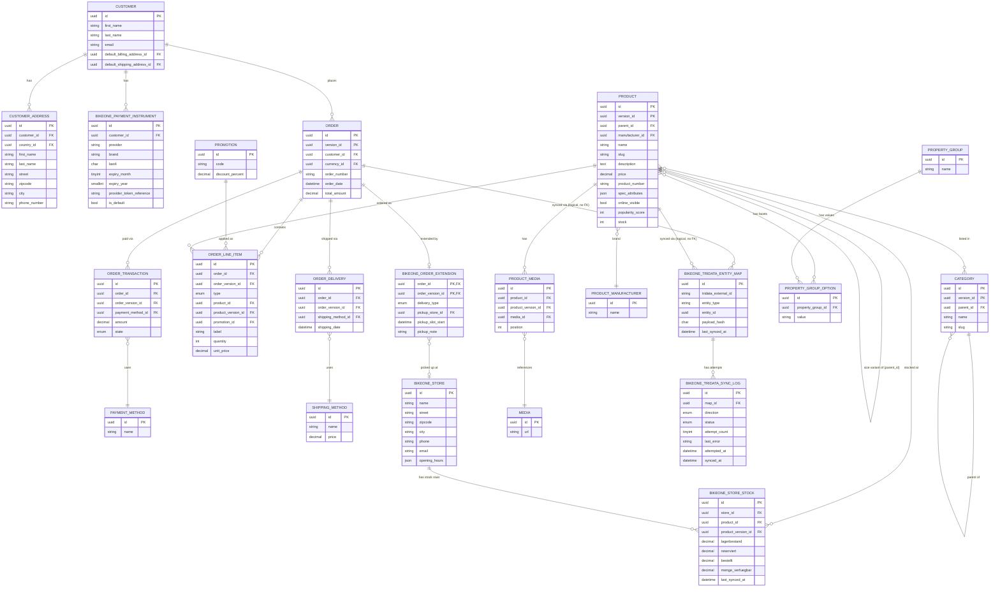

# Database Schema

## Purpose & scope

This is the full entity-relationship design for the shop's data — every entity the storefront, cart/checkout, customer account area, and Tridata/TriCon sync need, at field level. It targets MySQL 8 / MariaDB 10.11, the engine already fixed by the Shopware decision ([decisions.md:13,41](../3-Architecture_Tech_Stack/decisions.md)), via Shopware's own Doctrine-based data access layer (DAL) rather than a separate application database.

Shopware ships a large data model out of the box. To avoid quietly re-implementing what already exists — or missing what it doesn't cover — every entity below is tagged with its **Shopware status**:

- **native** — an existing Shopware entity, used as-is, no changes needed.
- **extended** — an existing Shopware entity, plus a one-to-one custom extension table or `customFields` (never new columns bolted directly onto the core table — see naming/versioning note below).
- **custom** — a wholly new entity with no Shopware equivalent.

The schema is portable across environments: self-hosted `dockware` is dev-only ([local-dev-setup.md:9](../3-Architecture_Tech_Stack/local-dev-setup.md)), and staging/prod hosting is a separate, still-open decision ([decisions.md:37-66](../3-Architecture_Tech_Stack/decisions.md)). Because the target engine (MySQL/MariaDB) doesn't change with the hosting provider, nothing here needs to change when that decision lands.

Phase 5 (this document) is design only. Phase 6 (Backend build, Claude Code) implements it as Shopware entity definitions, migrations, and the TriCon sync integration.

### Naming & versioning conventions

- **Table prefix.** All custom tables use a `bikeone_` prefix (e.g. `bikeone_store`, `bikeone_store_stock`) to avoid future collisions with core Shopware tables — `store` in particular is a plausible name for Shopware to use itself in a later release.
- **ID columns.** Shopware ids are `BINARY(16)`, not `CHAR(36)` text UUIDs. The ERD below shows `uuid` as a domain label for readability; the physical column type is `BINARY(16)`.
- **Versioned entities.** `product`, `order`, and `category` are Shopware versioned entities: their real primary key is the composite `(id, version_id)`, used for draft/live versioning (e.g. cart-in-progress order versions). Any custom table with a foreign key into one of these must carry **both** columns (`..._id` + `..._version_id`), not a single-column FK — a single-column FK either fails to create or silently drops version scoping. **Resolved: target Shopware 6.7** (already implied by [decisions.md](../3-Architecture_Tech_Stack/decisions.md)'s "PHP 8.4 on Shopware 6.7", now stated explicitly here so this document doesn't drift from it). Whether `customer` is also versioned should still be verified against 6.7's actual schema at Phase 6 kickoff — a quick doc/DB check, not an open design decision.
- **Enums.** Fields marked `enum` in the diagram below are a domain label, not the native MySQL `ENUM` type. They should be implemented as `VARCHAR` + `CHECK` constraint, since MySQL `ENUM` requires an `ALTER TABLE` to add a value and orders values by their declared index rather than alphabetically — both are footguns for a fast-moving v1.
- **Reserved word.** `order` is a reserved SQL keyword. Raw SQL against it needs backtick-quoting (`` `order` ``); Shopware's DAL handles this automatically, but any hand-written migration or query must not forget it.

## Entity overview

| Entity | Shopware status | Notes |
| --- | --- | --- |
| `sales_channel` | native | Storefront + (possibly) per-store channels |
| `currency` | native | EUR only for v1 |
| `language` | native | DE (default) + EN |
| `country` | native | DE / AT / CH for shipping |
| `payment_method` | native | SumUp card, PayPal |
| `shipping_method` | native | Standard, Express |
| `promotion` | native | Covers coupon codes (e.g. `BIKEONE10`); applied to an order as an `order_line_item` of type `promotion`, not a separate order↔promotion join |
| `order_transaction` | native | Order↔payment-method link (the ERD in v1 of this doc incorrectly drew a direct order↔payment_method relation) |
| `order_delivery` | native | Order↔shipping-method link (same correction) |
| `category` | native | 6 top-level cats + parent grouping; versioned entity |
| `product_manufacturer` | native | Brand |
| `property_group` / `property_group_option` | native | Frame size, usage tag, other facets — the single source of truth for usage tag, see `product` below |
| `media` / `product_media` | native | Product images/gallery; `product_media` is the join table, `media` itself is not product-owned |
| `customer` | native | |
| `customer_address` | native | Address book; default addresses are pointers on `customer`, not a flag on the address |
| `number_range` | native | Order-number generation |
| `product` (+ size variants via `parent_id`) | extended | Spec table, Tridata mapping, popularity, `online_visible`. There is no separate variant table — a size variant is a `product` row with `parent_id` set, using Shopware's native configurator system |
| `order` | extended | Delivery type, pickup slot — via a one-to-one `bikeone_order_extension` table, not columns added to `order` itself |
| `bikeone_store` | custom | 2 fixed physical locations |
| `bikeone_store_stock` | custom | Per-store, per-product stock cache from Tridata |
| `bikeone_payment_instrument` | custom | Tokenized saved cards |
| `bikeone_tridata_entity_map` | custom | Current-state ID mapping between Shopware and Tridata entities (small, hot table) |
| `bikeone_tridata_sync_log` | custom | Append-only sync attempt history (large, cold table, purged on a retention window) |

## Entity-relationship diagram

Native, extended, and custom entities are mixed together here on purpose — the diagram shows how data actually connects, with a realistic full field set per entity (not just PK/FK stubs) so it reads as a complete model on its own. The [entity overview](#entity-overview) table above is where the Shopware-status tagging lives. `entity_id` on `BIKEONE_TRIDATA_ENTITY_MAP` is polymorphic (points at either a `product` or an `order` row depending on `entity_type`) and is therefore drawn as a relation but is **not** a real foreign key — it cannot be, since it targets different tables — and must be validated at the application layer instead. `spec_attributes` is drawn as a single `json` field per the "customFields JSON blob" option noted in the open questions — if the structured-custom-field-set option is chosen instead, this becomes one column per spec key (`spec_frame`, `spec_fork`, …).

## Native Shopware entities (used as-is)

These need no schema changes; they're listed so the ERD is complete and so Phase 6 doesn't reinvent them.

- **`sales_channel`** — the storefront. One channel is enough for v1; the 2 physical stores are modeled as their own `bikeone_store` entity (below), not as separate sales channels, since they share one catalog/checkout and only differ by pickup location.
- **`currency`** — EUR only; no multi-currency requirement found anywhere in planning docs.
- **`language`** — DE (default) + EN, driving Shopware's native `*_translation` tables for product name/description, category name, and CMS content ([questions.de.md:124](../2-Product_Requirements/questions.de.md); [prompts.md:31](../4-UI_UX_Wireframes)).
- **`country`** — DE/AT/CH, used by the checkout address form's country select.
- **`payment_method`** — one row per method (SumUp Card, PayPal); Apple Pay/Google Pay added later as more rows, not a schema change ([decisions.md:25](../3-Architecture_Tech_Stack/decisions.md)). Linked to an order via native `order_transaction`, not a direct FK on `order`.
- **`shipping_method`** — Standard (€6.90) and Express (€12.90), with Shopware's native free-shipping-threshold rule covering the €5000 cutoff. Linked to an order via native `order_delivery`.
- **`promotion`** (+ `promotion_discount`) — covers the coupon-code + percentage-discount behavior shown in the cart wireframe (hardcoded `BIKEONE10` = 10%). Applied promotions are represented as an `order_line_item` row of type `promotion`, not a separate order↔promotion join table — the v1 ERD drew this incorrectly.
- **`category`** — Shopware's native tree/parent-child support covers both the 6 top-level categories (Rennrad, Gravel, Zubehör, Komponenten, Bekleidung, Werkstatt/Service) and the "Fahrräder" grouping implied by the gravel-bikes breadcrumb over Rennrad/Gravel. `category` is a versioned entity (composite `(id, version_id)` PK).
- **`product_manufacturer`** — brand, used as a filter facet on category listing pages.
- **`property_group`** / **`property_group_option`** — generic facet system covering frame size (Rahmengröße), usage/riding-style tag (Einsatzbereich: allroad/bikepacking/renneinsatz/schotter), and any future facets like color, without new tables per facet. This is the **single** source of truth for the usage tag — see the `product` section below for why a duplicate `usage_tag` column was removed.
- **`media`** / **`product_media`** — product gallery images. `media` is a standalone entity (not owned by one product); `product_media` is the join table carrying `position`, since the same media asset can in principle be reused.
- **`customer`** — profile fields (`first_name`, `last_name`, `email`) match native Shopware customer fields directly. **Correction from the v1 draft:** `phone` belongs on `customer_address` (`phone_number`), not on `customer` itself, and there is no boolean default flag on the address — instead `customer.default_billing_address_id` / `customer.default_shipping_address_id` point at the chosen `customer_address` rows. Both corrections should be re-verified against the exact Shopware version targeted before Phase 6 (see open questions) — Shopware's field layout has shifted across major versions.
- **`customer_address`** — address book with multiple addresses, matching the account-area wireframe; the "default" concept lives on `customer` as described above, not as a per-address flag.
- **`number_range`** — Shopware's configurable order-number generator; needs a custom pattern configured (not a schema change) to produce `BO-YYYY-NNNNNN` — confirm this pattern is achievable with Shopware's native number-range syntax before assuming a custom field is needed (open question below).

## Extended Shopware entities

### `product` (+ size variants)

| Field | Type | Purpose | Tridata ownership |
| --- | --- | --- | --- |
| `spec_frame` … `spec_color` | JSON (`customFields` blob) | Free-text spec table pairs: Rahmen, Gabel, Schaltung, Bremsen, Laufräder, Reifen, Sattelstütze, Gewicht, Max. Zuladung, Rahmengrößen, Farbe. These are display-only and not filterable — anything that needs to be a filter facet (like usage tag or frame size) belongs in `property_group`/`property_group_option`, not here | Shop-owned (editorial content, not Tridata) |
| `popularity_score` | int | Sort key for "popular" listing sort. Recomputed in a nightly batch job from sales data and written only when the value actually changes, rather than on every sale — a per-sale write would trigger Shopware's search/listing indexer on every order and add needless load | Shop-owned (derived from sales data) |
| `online_visible` | boolean | Whether this Tridata-stocked item is listed in the shop at all — not every Tridata SKU is online. Business rule: `true` only for items with physical on-site stock at one of the 2 stores (some bikes, some accessories) — a Tridata SKU with no in-store stock stays `false` regardless of what Tridata otherwise carries ([questions.de.md:83-85](../2-Product_Requirements/questions.de.md)) | Shop-owned, derived from in-store stock presence |

**Removed from the v1 draft:** a `usage_tag` enum column on `product`. The v1 draft specified the usage tag both as a `property_group_option` (native facet system) and as this column, which is two sources of truth for the same fact with no rule for which wins. `property_group_option` is kept as the single source, since it's also how the facet filter UI already reads it.

**Removed from the v1 draft:** the `tridata_article_number` column. Earlier drafts kept this as a denormalized read cache of the mapping already held in `bikeone_tridata_entity_map`, but a cache that duplicates a lookup table is a second source of truth for no real benefit here — any code needing the Tridata article number joins `bikeone_tridata_entity_map` (`entity_type = 'product'`) instead.

**Decided:** `spec_frame`…`spec_color` uses Shopware's generic `customFields` JSON blob rather than a structured custom-field set. These fields are editorial/display-only (see above), so the JSON blob's only real cost — not being independently filterable per key — doesn't apply; the flexibility of adding a new spec key without a migration wins. If a specific spec ever needs to become a filter facet, it moves to `property_group`/`property_group_option`, the same path `usage_tag` already took.

Size variants (Rahmengröße) use Shopware's native product variant/configurator system: one parent `product` row, one child `product` row per size (linked via `parent_id`), each with its own native `stock` field. There is no separate variant table — the v1 draft's `PRODUCT_VARIANT` entity had no Shopware equivalent and has been removed from the ERD; anything that referenced it (`order_line_item`, `bikeone_store_stock`) now references `product` directly via `product_id` + `product_version_id`. This still covers the per-size stock states (`lager` / `bestellbar` / `oos`) shown on the product detail page.

**Stock authority.** `product.stock` (native) and `bikeone_store_stock` (custom) both represent stock, and both are read caches fed from the same Tridata inbound sync — neither is independently shop-owned, and they must not be allowed to drift from separate write paths. `product.stock` is the shop-wide sellable total used at checkout for shipping orders; `bikeone_store_stock` is the per-store breakdown used for the Click & Collect availability UI. Both are written by the same sync job from the same feed.

Google Merchant Center feed fields (product ID, title, description, price, availability, GTIN/MPN, image, category — [questions.de.md:129](../2-Product_Requirements/questions.de.md)) all map to native Shopware product fields plus the extensions above; no separate feed table needed.

### `order`

`order_number` itself is a native Shopware field — no new column needed, just a custom `number_range` pattern configured to produce `BO-YYYY-NNNNNN`. **Resolved:** confirmed achievable natively — Shopware 6's number-range "Advanced" mode pattern supports a fixed prefix plus placeholders including `{n}` (an incrementing sequence number) and date placeholders, which together cover the `BO-YYYY-NNNNNN` shape without a custom field. The exact placeholder names/zero-padding syntax are an implementation detail to confirm against the Shopware 6.7 docs when the number range is actually configured in Phase 6, not a design gap. **This is a distinct number from TriCon's `WebShopOrderID`** (see `bikeone_tridata_entity_map` above) — `BO-YYYY-NNNNNN` is the customer-facing order number, `WebShopOrderID` is a separate integer TriCon requires for its own order-matching, and the two must not collide with each other or with TriBike's internal order numbering. The v1 draft added `delivery_type`, `pickup_store_id`, `pickup_slot`, and `return_state` as raw columns on `order` itself; that means editing Shopware's core table, which the extension pattern below avoids. Instead:

#### `bikeone_order_extension` (one-to-one extension table)

| Field | Type | Purpose | Tridata ownership |
| --- | --- | --- | --- |
| `order_id` / `order_version_id` | UUID, UUID (composite PK, composite FK → `order.(id, version_id)`, `ON DELETE CASCADE`) | Ties the extension row to its exact order version | — |
| `delivery_type` | varchar + CHECK (`shipping`, `pickup`) | Cart/checkout delivery method choice | Shop-owned |
| `pickup_store_id` | FK → `bikeone_store.id`, nullable | Which store, when `delivery_type = pickup` | Shop-owned |
| `pickup_slot_start` | datetime, nullable | Structured slot start time (was a mixed free-text/datetime field in the v1 draft — split so "today 16:00" style slots are queryable/sortable) | Shop-owned |
| `pickup_note` | varchar, nullable | Free-text fallback, e.g. "we'll contact you" | Shop-owned |

A `CHECK` constraint enforces consistency between these fields: `pickup_store_id` must be set if and only if `delivery_type = 'pickup'`, and `pickup_slot_start`/`pickup_note` must be null when `delivery_type = 'shipping'`. Nothing in the v1 draft prevented a `shipping` order from also carrying a `pickup_store_id`, or a `pickup` order from carrying neither.

**`return_state` removed.** The v1 draft stored this as an enum (`not_yet`/`active`/`expired`) directly on `order`, but `expired` is purely a function of elapsed time since delivery — a stored value goes stale the moment 30 days pass unless something proactively flips it. It should be computed at read time from the delivery date on `order_delivery` plus the 30-day window, not stored.

Order line items, deliveries, and payment links use Shopware's native `order_line_item` / `order_delivery` / `order_transaction` entities. Orders sync outbound to Tridata (shop → Tridata) per the bidirectional sync model below.

**Decided: keep the custom `delivery_type`/`pickup_store_id` fields**, rather than modeling pickup purely as a native Click & Collect `shipping_method`. A `shipping_method` row can't natively carry a specific store choice or a pickup time slot — that would still need a custom extension table alongside it, so folding pickup into `shipping_method` wouldn't actually remove `bikeone_order_extension`, just make the delivery-type distinction implicit in which shipping method was chosen instead of an explicit column. The explicit field is easier to query and reason about for the same amount of custom schema.

**Confirmed by the real TriCon interface:** `pickup_store_id` maps directly onto TriCon's `Filialname` field on `UploadOrder` — set it to the picked-up-at store's name on outbound sync when `delivery_type = 'pickup'`, so TriBike routes the order to the correct physical store. This only applies if BikeOne's TriBike instance uses the "one interface for all branches" model rather than a separate interface per store — see [tricon-integration-notes.md](../3-Architecture_Tech_Stack/tricon-integration-notes.md), one of two configuration questions still open with TriData support, not a design gap in this schema.

**Data retention.** `customer` must never cascade-delete into `order` (or `bikeone_order_extension`). German tax law requires order records be retained roughly 10 years (§147 AO, §257 HGB) regardless of customer deletion requests. Use Shopware's native customer anonymization/GDPR-erasure flow, which relies on `order_customer` snapshotting the customer's data onto the order at the time of purchase — orders keep their own copy of the data and survive the source `customer` row being anonymized or removed.

## New custom entities

### `bikeone_store`

Exactly 2 fixed rows for v1 — Oldenburg and Osnabrück (see saved memory `bike-one-store-locations` for exact addresses/contacts).

| Field | Type | Notes |
| --- | --- | --- |
| `id` | UUID (PK) | |
| `name` | varchar (UNIQUE) | "Oldenburg", "Osnabrück" |
| `street` | varchar | |
| `zipcode` | varchar | |
| `city` | varchar | |
| `phone` | varchar | |
| `email` | varchar | |
| `opening_hours` | JSON | Structured per-weekday open/close times rather than a single free-text string (the v1 draft used free text) — the storefront still renders it as the same human-readable string ("Mo–Fr 10:00–18:00 · Sa 10:00–14:00"), but the structured form also lets Phase 6 compute "open now" without parsing text |

### `bikeone_store_stock`

Per-store, per-product stock cache for Click & Collect, since Tridata is the single source of truth for stock and this table is a synced read cache, not shop-owned state.

| Field | Type | Notes |
| --- | --- | --- |
| `id` | UUID (PK) | |
| `store_id` | FK → `bikeone_store.id` | `ON DELETE RESTRICT` — only 2 fixed stores, deleting one out from under stock rows should be a deliberate migration, not an accident |
| `product_id` / `product_version_id` | FK → `product.(id, version_id)` | `ON DELETE CASCADE`; composite, per the versioned-entity note above |
| `lagerbestand` | decimal | Physical stock on hand at this store, per TriCon's `DownloadStockBranch`/`DownloadStockColorSizeBranch` field of the same name |
| `reserviert` | decimal | Already reserved against other (e.g. in-store) orders |
| `bestellt` | decimal | On order from a supplier / backordered |
| `menge_verfuegbar` | decimal | TriBike's own computed sellable quantity — TriCon's reference explicitly calls this **the authoritative number**, not a shop-side recomputation from the other three. Checkout and the storefront's `in_stock`/`bestellbar`/`oos` display states are derived from this field (`> 0` → in stock; `= 0` with `bestellt > 0` → on order; else out of stock) rather than storing a separate status column |
| `last_synced_at` | datetime | Freshness of the Tridata-sourced cache |

**Revised from an earlier draft of this document**, which invented a `status` enum (`in_stock`/`on_order`) plus `quantity`/`eta_days_min`/`eta_days_max` before TriCon's actual field shapes were known. The real interface returns four numeric fields (`double` in TriCon's own schema, hence `decimal` here rather than `int` — some accessories may be sold by weight/length) instead of a status classification; see [tricon-integration-notes.md](../3-Architecture_Tech_Stack/tricon-integration-notes.md) for the full mapping. This still replaces the original v1 draft's single free-text `quantity_or_eta_text` column (which mixed a number and German display text in one field — a 1NF violation) with structured, TriCon-shaped data; the storefront's localized display text is now derived entirely from `menge_verfuegbar`/`bestellt` at render time.

A `UNIQUE (store_id, product_id, product_version_id)` constraint makes the sync job's per-poll upsert idempotent — without it, each 10-minute poll risks inserting duplicate rows per store/product instead of updating the existing one.

**Resolved: keep this custom entity.** Shopware 6 (Community Edition, self-hosted, since v6.4) does have basic native per-warehouse stock under Settings → Commerce → Warehouses. But the specific capability this table needs — warehouse stock driven by an external ERP feed rather than manual admin entry — is the *Multi-Inventory* feature, which is part of the paid Commercial/"Beyond" plan, not Community Edition. Since only the free Community Edition is budgeted for this project, native warehouse stock isn't a substitute here; `bikeone_store_stock` stays as the sync target. Revisit only if the Beyond plan is purchased for other reasons.

**Open, vendor-side (not a design gap):** whether TriCon's branch-aware stock functions apply to BikeOne's 2-store setup at all depends on how the connected TriBike instance is configured (see [tricon-integration-notes.md](../3-Architecture_Tech_Stack/tricon-integration-notes.md#two-configuration-questions-to-put-to-tridata-support-directly)) — this table's design holds either way, but the actual sync job's shape depends on the answer.

### `bikeone_payment_instrument`

Tokenized saved cards only — never raw card data, matching the "processor-hosted secure widget" checkout flow and the masked brand+last4+expiry shown in the account area. Renamed from the v1 draft's `customer_payment_instrument` to carry the standard custom-table prefix.

| Field | Type | Notes |
| --- | --- | --- |
| `id` | UUID (PK) | |
| `customer_id` | FK → `customer.id`, `ON DELETE CASCADE` | Unlike orders, saved cards carry no statutory retention duty, so cascading on customer deletion is correct here |
| `provider` | varchar | e.g. `sumup` |
| `brand` | varchar | e.g. "Visa" |
| `last4` | char(4), CHECK (4 digits) | |
| `expiry_month` | tinyint, CHECK (1–12) | |
| `expiry_year` | smallint | |
| `provider_token_reference` | varchar, UNIQUE per `provider` | Opaque SumUp token reference; no raw PAN ever stored |
| `is_default` | boolean | |

**Security note.** `provider_token_reference` is a charge-capable secret, unlike `last4`/`expiry`/`brand` which are safe to display. It should sit behind a restricted DB grant, never be written to logs, and never be returned by any API response beyond the masked display fields. Expired instruments should be purged by a scheduled job rather than left indefinitely.

PayPal is not a saved/reusable wallet method per the wireframes, so it has no row here — it's a payment-method choice made fresh at each checkout.

### `bikeone_tridata_entity_map` and `bikeone_tridata_sync_log`

The v1 draft's single `tridata_sync_log` entity did double duty as both an ID-mapping table (one row per synced entity, looked up on every sync) and an append-only audit log (one row per sync attempt, growing forever) — with no indexes for either job. Splitting these:

#### `bikeone_tridata_entity_map` — current state, small and hot

| Field | Type | Notes |
| --- | --- | --- |
| `id` | UUID (PK) | |
| `tridata_external_id` | varchar | Tridata-side identifier — see below, its meaning and which side mints it differs by `entity_type` |
| `entity_type` | varchar | e.g. `product`, `order` |
| `entity_id` | UUID | Polymorphic reference — validated in application code, not a real FK, since it targets different tables depending on `entity_type` |
| `payload_hash` | char(64) | Hash of the last-synced payload; lets the sync job skip writing (and re-indexing) rows whose data hasn't actually changed since the last poll |
| `last_synced_at` | datetime | |

`UNIQUE (entity_type, tridata_external_id)` and `UNIQUE (entity_type, entity_id)` make lookups from either direction of the sync O(1).

**Confirmed against the real TriCon interface** ([tricon-integration-notes.md](../3-Architecture_Tech_Stack/tricon-integration-notes.md)) — `tridata_external_id` holds a different kind of value depending on direction, which the varchar type already accommodates without a schema change:
- `entity_type = 'product'`: TriBike's `ArtikelID` (a GUID) for a parent item, or `ArtikelGrFaKombiID` for a size/color variant — **TriBike mints this ID**, the shop only stores it.
- `entity_type = 'order'`: TriCon's `WebShopOrderID` (an `int`) — **the shop mints this ID**, the reverse direction from products. TriCon requires it to use a number range distinct from both TriBike's own internal order numbers *and* Shopware's customer-facing `order_number` (`BO-YYYY-NNNNNN`). Recommendation: use Shopware's native `autoIncrement` integer field on `order` — already unique and monotonic, and unrelated to either of the other two numbering schemes, so nothing new needs inventing.

#### `bikeone_tridata_sync_log` — append-only attempt history

| Field | Type | Notes |
| --- | --- | --- |
| `id` | UUID (PK) | |
| `map_id` | FK → `bikeone_tridata_entity_map.id`, `ON DELETE CASCADE` | |
| `direction` | varchar + CHECK (`inbound`, `outbound`) | |
| `status` | varchar + CHECK (`success`, `failed`, `pending`) | |
| `attempt_count` | tinyint | |
| `last_error` | varchar, PII-scrubbed | Never store customer PII here — this table is diagnostic, not a record of order contents |
| `attempted_at` | datetime | Renamed from the v1 draft's single `synced_at`, which was non-nullable but also had to represent a `pending` row that hasn't synced yet — a contradiction |
| `synced_at` | datetime, nullable | Set only once the attempt actually succeeds |

This table is append-only and should be purged on a retention window (e.g. 30 days) or partitioned by month once volume is known, rather than growing unbounded — it exists for idempotency and troubleshooting, not as a permanent audit trail.

**Resolved:** TriCon is confirmed SOAP/XML (not REST/JSON) — see [tricon-integration-notes.md](../3-Architecture_Tech_Stack/tricon-integration-notes.md) for the full analysis and [tricon-interface-reference.html](../3-Architecture_Tech_Stack/tricon-interface-reference.html) for the complete 44-function reference this project now has archived. The field types above (`direction`, `status`, `attempt_count`, etc.) hold regardless of the wire format and don't need to change; what's now concrete is what actually fills `bikeone_tridata_entity_map.tridata_external_id` per direction — see that table's own notes above.

## Tridata/TriCon sync model

Tridata is the single source of truth for stock, price, and orders ([questions.de.md:48](../2-Product_Requirements/questions.de.md)). The original ask was near-real-time sync ([questions.de.md:49](../2-Product_Requirements/questions.de.md)), but TriCon's shortest supported sync interval is 5 minutes, so true real-time isn't available — this is a polling model, not a push/webhook one:

- **Inbound (Tridata → shop), polled every 10 minutes:** catalog via `DownloadArtikelAll` (initial) then `DownloadArtikel` with `LastChange` (incremental); stock via `DownloadStock(Delta)` or the `*Branch*`/`*ColorSize*` variants, into `product`/`stock`/price fields and into `bikeone_store_stock`. 10 minutes gives a safety margin above TriCon's 5-minute floor (headroom for slow responses or transient failures without missing the next window) while still keeping the shop's shown stock and price close to what Tridata has. Each poll writes through `bikeone_tridata_entity_map`, comparing `payload_hash` first so unchanged rows are skipped entirely — a full-catalog write on every poll would otherwise touch every product's `updated_at` and trigger Shopware's search/listing indexer needlessly. This leaves a residual overselling window of up to ~10 minutes between an in-store sale and it reflecting online. **Decided:** checkout performs a final stock re-check at order placement (a live `DownloadStockByArtikel` call, which exists specifically for on-demand single-item checks) rather than accepting the overselling risk — with no dedicated logistics staff yet ([questions.de.md:84-85](../2-Product_Requirements/questions.de.md)), an oversold order is more costly to unwind by hand than a rare checkout-time delay is to the customer.
- **Outbound (shop → Tridata):** completed orders flow out via a single `UploadOrder` call (customer, delivery address, order header, and every line item together) so in-store staff see them in Tridata itself as their order queue — no separate shop-side admin needed ([questions.de.md:74-75](../2-Product_Requirements/questions.de.md)). Not bound by the 5-minute floor the same way, since it's the shop pushing on its own schedule rather than polling Tridata; still worth batching orders on the same interval rather than firing one request per order, both to bound TriCon call volume and to keep to a single retry/idempotency pattern shared with the inbound side. Post-purchase updates (`UploadOrderChangeBezahlt` once payment settles, `UploadOrderChangeStorno` for cancellations) and status polling (`DownloadOrderStateByOrder`) follow the same `WebShopOrderID` used on the original upload — see `bikeone_tridata_entity_map` above.

Every synced record — in either direction — gets a `bikeone_tridata_sync_log` row for idempotency and troubleshooting, keyed off its `bikeone_tridata_entity_map` row. TriCon is confirmed SOAP/XML ([tricon-integration-notes.md](../3-Architecture_Tech_Stack/tricon-integration-notes.md)); the dev environment's WireMock stubs should be built against those real XML shapes, not the earlier XML/JSON hedge ([local-dev-setup.md:11](../3-Architecture_Tech_Stack/local-dev-setup.md)). Because it's SOAP/XML, the integration must disable external entity/DTD resolution in the XML parser (standard XXE hardening). The sync integration should also run under its own DB credential scoped to stock/price fields and the `bikeone_tridata_*` tables — not a full DAL-admin credential — and outbound order payloads to Tridata carry customer PII, which should be covered by a data processing agreement with Tridata.

## Open questions / gaps

The TriCon protocol question — previously the one genuine blocker here — is now resolved: TriCon is confirmed SOAP/XML, with a full 44-function reference archived at [tricon-interface-reference.html](../3-Architecture_Tech_Stack/tricon-interface-reference.html) and analyzed in [tricon-integration-notes.md](../3-Architecture_Tech_Stack/tricon-integration-notes.md). That analysis resolved most of this schema's remaining uncertainty (see the inline notes on `bikeone_store_stock`, `bikeone_tridata_entity_map`, and the sync model above) but also surfaced two narrower replacements — vendor-configuration facts this project can't determine itself, rather than open design decisions:

- **Branch model (`Filialen`)** — whether BikeOne's TriBike instance uses "one interface for all branches" (branch-aware stock/order functions apply, `bikeone_store_stock` gets fed close to as-designed) or "one interface per branch" (would need a different integration shape entirely, likely a separate connection per store). Needs an answer from TriData support (+49 911 247675-0 / support@tridata.de) alongside the sandbox-access request — not resolvable from documentation alone.
- **Color/size module (`Größen Farben Modul`)** — whether it's active determines whether size variants arrive pre-linked to a parent item (`DownloadGrFaKombi` → maps cleanly onto this schema's `product.parent_id`) or as flat, unrelated items needing shop-side grouping logic. Same vendor-confirmation path as above.

Still open, unrelated to TriCon:

- **VAT rate — resolved with a recommendation, not a hard fact.** No numeric VAT rate or tax-class model was specified anywhere in planning. Recommendation: a single standard German VAT rate (19%) via Shopware's native tax-rule system — bicycles, accessories, and apparel don't fall into any of the reduced-rate (7%) categories under German VAT law (those are narrowly defined: books, food, some cultural/medical goods), so no reduced-rate tax class is needed for v1. This needs a final sign-off from an accountant/tax advisor before launch, but the schema itself is unaffected either way — Shopware's native tax-rule system handles a rate change without a migration. Native `order_line_item` pricing is a JSON structure carrying the tax breakdown, which this document simplifies to a single `unit_price decimal` for readability elsewhere. Note: TriCon's own `Artikel` object carries a per-item `MehrwertSteuerSatz` (VAT rate) field, which may simplify this further — mapping TriBike's existing rate to a Shopware tax rule, rather than deciding a rate independently — worth checking once catalog data is actually flowing.

Everything else previously flagged here is now a stated decision rather than an open question: Shopware version (6.7, matching [decisions.md](../3-Architecture_Tech_Stack/decisions.md)), native multi-warehouse support (Community Edition's version doesn't cover the ERP-driven use case this needs, so `bikeone_store_stock` stays), the order-number pattern (native number-range Advanced mode covers it, distinct from TriCon's own `WebShopOrderID`), `delivery_type` vs. native `shipping_method` (keep the custom fields, confirmed mapping onto TriCon's `Filialname`), the spec-table field shape (`customFields` JSON blob), the overselling-window policy (final stock re-check at order placement, now mapped onto a concrete `DownloadStockByArtikel` call), and `tridata_article_number` (dropped, `bikeone_tridata_entity_map` is the only lookup).

## Out of scope for v1

- Bike-fitting appointment booking (link exists in the wireframe, but the booking flow itself is post-v1 — [questions.de.md:72-73](../2-Product_Requirements/questions.de.md)).
- Wishlist (no such tab in the account-area wireframe).
- Multi-currency (EUR only, no requirement found).
- Reviews/ratings (absent from every product wireframe).
